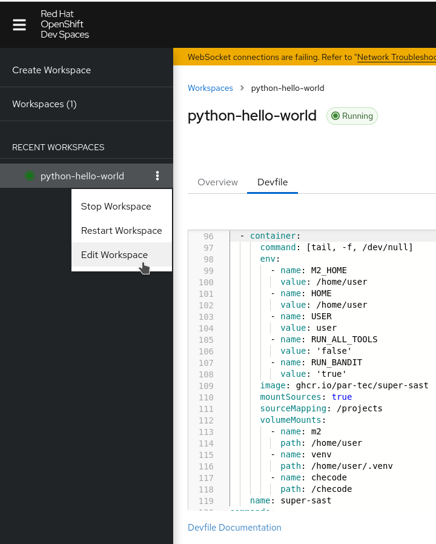
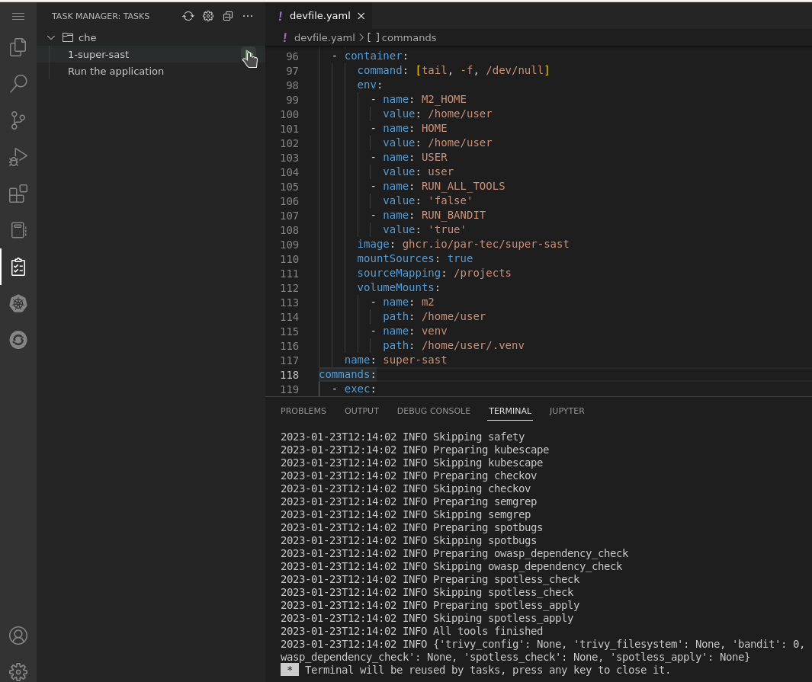

# Super SAST on Dev Spaces

Note: before running containerized tools in Dev Spaces, you need to ensure that the OCI image
and the associated tools are available for the target architecture that Dev Spaces runs on.
For example, an x86_64 image will not run by default on an arm64 architecture.

## Introduction

[Dev Spaces](https://developers.redhat.com/products/openshift-dev-spaces/overview) is a SaaS offering that allows you to develop and test your code in a Kubernetes cluster.
Dev Spaces use [devfile.io](https://devfile.io) to define the development environment and the build process of an application.
You can run super-sast on Dev Spaces.

## Creating a Dev Spaces project

When you create a Dev Spaces project, it produces a devfile containing various components and commands.

The devfile contains the reference to the Source Code Manager (SCM), e.g.

```yaml
projects:
  - name: python-hello-world
    zip:
      location: 'http://devfile-registry.openshift-Dev Spaces.svc:8080/resources/v2/python-hello-world.zip'
```

The principal container is the one bootstrapping the vscode IDE.
This container usually mounts different volumes,
including one that is specific to the language (e.g. /home/user/.m2 for maven or /home/user/.venv for python).

```yaml
...
components:
  - name: python  # or other default name depending on the language.
    ...
    container:
      mountSources: true
      sourceMapping: /projects
      volumeMounts:
        - name: venv
          path: /home/user/.venv
        - name: checode
          path: /checode
  - name: venv
    volume:
      size: 1G
```

The result is a `deployment.apps` kubernetes resource with a pod containing multiple containers

```bash
$ oc get deployment.apps
NAME                        READY   UP-TO-DATE   AVAILABLE   AGE
workspace841dc8dbaea54416   1/1     1            1           3d20h
```

## Configure your workspace to run super-sast

To run super-sast, edit your workspace's devfile and:

1. add a new container to the default one;

```yaml
components:
  ...
  - name: super-sast
    # To have a consistent behavior, pin a specific container version.
    image: ghcr.io/par-tec/super-sast:20230118-34-d57077c
    mountSources: true
    sourceMapping: /projects
    volumeMounts:
      - name: venv
        path: /home/user/.venv
    command: [tail, -f, /dev/null]
```

1. add a new command to run the super-sast container.

```yaml
commands:
  ...
  - id: super-sast
    exec:
      component: super-sast
      commandLine: sh -c 'python /entrypoint.py'
      # The workingDir depends on the specific installation.
      #   Use the value from the default commands.
      workingDir: '${PROJECTS_ROOT}/python-hello-world'
      group:
        kind: run
        isDefault: true
```



See the following example Dev Spaces workspace devfiles:

- [python](devspaces-workfile-super-sast-python.yaml)
- [quarkus](devspaces-workfile-super-sast-quarkus.yaml)

Once you save and redeploy your workspace, you can run super-sast:

- [via command line](#run-command-line) using the embedded `oc` command;
- [via the "Task Manager" vscode extension](#run-task-manager), if your organization explicitly allows you to install it.

The `super-sast.log` is accessible in the project directory tree
or via command line (see below).


### Running super-sast via command line {#run-command-line}

Since the workspace contains the `oc` command, you can access the super-sast container
in the workspace pod referencing the correct workspace name using
the specific label (e.g. `quarkus-quickstart` in the example below).

```bash
# Show the workspace pods
$ oc get deployment.apps --show-labels
$ SAST=$(oc get deployment.apps -o name -l controller.devfile.io/devworkspace_name=quarkus-quickstart)
$ oc rsh -c super-sast $SAST
/ $  # this is the super-sast shell.
```

In the super-sast container you can run the entrypoint,
specific tests, or even access the super-sast log file.

```bash
# run super-sast
/ $ python /entrypoint.py

# access the log file
/ $ cat /projects/python-hello-world/super-sast.log
```

### Running with the Task Manager extension  {#run-task-manager}

1. click on the "Task Manager" icon () on the left;
2. click on the "Run Task" button (▶️);



## Troubleshooting super-sast in Dev Spaces

You can troubleshoot issues using the `oc` command and/or running super-sast via command line in the vscode terminal.

If the sast container doesn't show up, check the openshift deployment status, or its events:

```bash
$ oc get all
...
$ oc get deployment.apps --show-labels

NAME                        READY   UP-TO-DATE   AVAILABLE   AGE    LABELS
workspace66ae6d95bfe64a26   1/1     1            1           50m    controller.devfile.io/devworkspace_name=quarkus-quickstart


$ oc get events --watch
... logs ...
```

If the `workspace` application is running, ensure that it provides all the containers deployed by the workspace devfile.
Then open a shell into the super-sast container.

```bash
# Access the sast container
$ SAST=$(oc get deployment.apps -o name -l controller.devfile.io/devworkspace_name=quarkus-quickstart)
$ oc rsh -c super-sast $SAST

# run super-sast from the project's directory.
/ $ cd /projects/
/projects $ python /entrypoint.py

# run a specific tool outside super-sast using default config files
/projects $ trivy --config /app/config/trivy.yaml filesystem .

# ..or reference specific config files provided by
#   your application's repository.
/projects $ trivy --config ./config/trivy.yaml filesystem .
```
